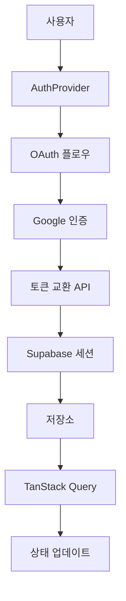
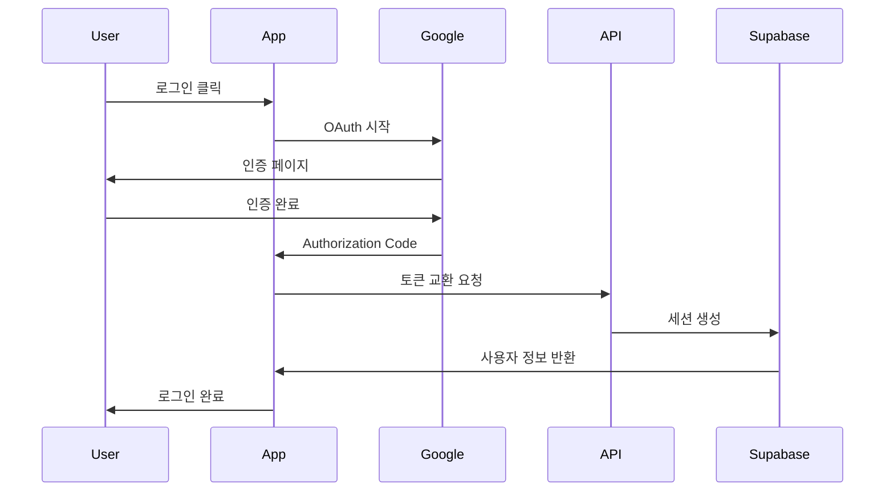
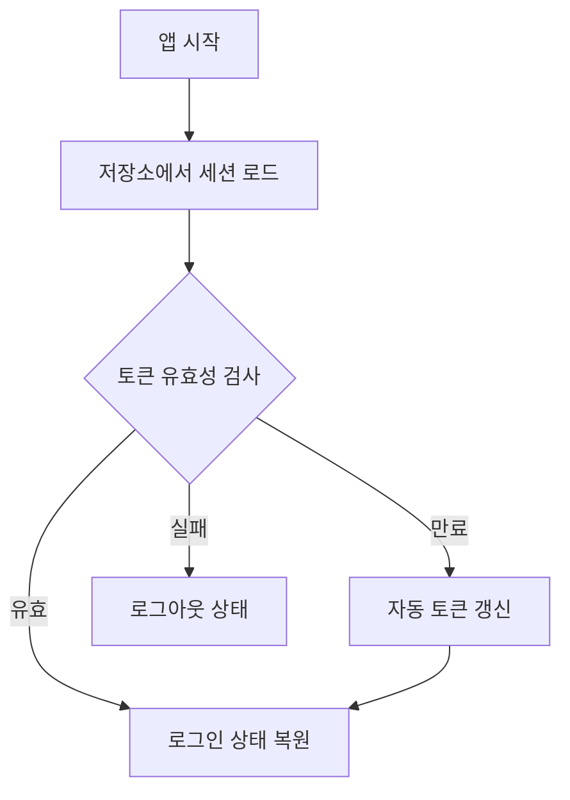

# 네이티브 앱 인증/인가 아키텍처

## 개요

Expo + Supabase + TanStack Query를 기반으로 한 안전하고 효율적인 인증 시스템입니다. Google OAuth를 통한 소셜 로그인과 플랫폼별 최적화된 세션 관리를 제공합니다.

## 아키텍처 구성도



## 핵심 구성 요소

### 1. 플랫폼별 OAuth 처리

#### **네이티브 환경 (iOS/Android)**
```typescript
// expo-auth-session 기반 OAuth
const [request, response, promptAsync] = useAuthRequest(config, discovery)

// 커스텀 서버 엔드포인트 사용
const discovery = {
  authorizationEndpoint: `${BASE_URL}/api/auth/authorize`,
  tokenEndpoint: `${BASE_URL}/api/auth/token`
}
```

#### **웹 환경 (Expo 웹 빌드)**
```typescript
// Supabase 기본 OAuth (COOP 에러 방지)
await supabase.auth.signInWithOAuth({
  provider: 'google',
  options: { redirectTo: callbackUrl }
})
```

### 2. 보안 저장소 관리

#### **네이티브: SecureStore + 청크 분할**

**파일**: `utils/supabase/client.ts`

```typescript
const CHUNK_SIZE = 1900; // SecureStore 2048 바이트 제한 고려

const supabaseStorage = {
  async setItem(key: string, value: string) {
    if (value.length <= CHUNK_SIZE) {
      // 단일 저장
      await SecureStore.setItemAsync(key, value);
    } else {
      // 청크 분할 저장
      const chunks = [];
      for (let i = 0; i < value.length; i += CHUNK_SIZE) {
        chunks.push(value.slice(i, i + CHUNK_SIZE));
      }
      
      await SecureStore.setItemAsync(`${key}_count`, chunks.length.toString());
      for (let i = 0; i < chunks.length; i++) {
        await SecureStore.setItemAsync(`${key}_${i}`, chunks[i]);
      }
    }
  }
}
```

**저장 구조**:
```
sb-project-auth-token_count: "3"
sb-project-auth-token_0: "eyJhbGciOiJIUzI1NiIs..."
sb-project-auth-token_1: "dHlwIjoiSldUIiwia2lk..."
sb-project-auth-token_2: "VCJ9.eyJhdWQiOiJhdXRo..."
```

#### **웹: 기본 localStorage**
```typescript
// Supabase 자동 처리 (별도 설정 불필요)
const supabase = createClient(url, key, {
  auth: { persistSession: true }
})
```

### 3. TanStack Query 상태 관리

#### **사용자 데이터 훅**

**파일**: `hooks/use-user.ts`

```typescript
export function useUser(initialUser?: User | null) {
  return useQuery({
    queryKey: ["user"],
    queryFn: async () => {
      const { data: { user } } = await supabase.auth.getUser()
      return user
    },
    staleTime: 15 * 60 * 1000, // 15분 캐시
    gcTime: Infinity,          // 세션 동안 유지
    retry: false               // 인증 실패시 재시도 안함
  })
}
```

#### **실시간 상태 동기화**

**파일**: `hooks/use-auth-state-effect.ts`

```typescript
export function useAuthStateEffect() {
  const queryClient = useQueryClient()
  
  useEffect(() => {
    const { data: { subscription } } = supabase.auth.onAuthStateChange(
      async (event, session) => {
        queryClient.setQueryData(["user"], session?.user ?? null)
        
        if (event === "SIGNED_OUT") {
          queryClient.clear() // 로그아웃시 모든 캐시 클리어
        }
      }
    )
    
    return () => subscription.unsubscribe()
  }, [queryClient])
}
```

### 4. AuthProvider 통합

**파일**: `context/auth.tsx`

```typescript
export const AuthProvider = ({ children }: PropsWithChildren) => {
  const { data: user = null, isLoading } = useUser()
  const [error, setError] = useState<AuthError | null>(null)
  
  // 실시간 상태 동기화
  useAuthStateEffect()
  
  const signOut = async () => {
    await supabase.auth.signOut()
    // onAuthStateChange가 자동으로 상태 업데이트
  }
  
  return (
    <AuthContext.Provider value={{ user, isLoading, signIn, signOut, error }}>
      {children}
    </AuthContext.Provider>
  )
}
```

## 인증 플로우

### 로그인 시퀀스



### 앱 재시작시 세션 복원



## API 엔드포인트

### 1. Authorization Endpoint

**파일**: `app/api/auth/authorize+api.ts`

```typescript
export async function GET(request: Request) {
  const url = new URL(request.url)
  const redirectUri = url.searchParams.get("redirect_uri")
  
  // 플랫폼별 state 구성
  const state = platform + "|" + url.searchParams.get("state")
  
  return Response.redirect(`${GOOGLE_AUTH_URL}?${params}`, 302)
}
```

### 2. Token Exchange Endpoint

**파일**: `app/api/auth/token+api.ts`

```typescript
export async function POST(request: Request) {
  const { code } = await request.json()
  
  // 1. Google OAuth 토큰 교환
  const googleTokens = await exchangeCodeForTokens(code)
  
  // 2. Supabase 세션 생성
  const { data, error } = await supabase.auth.signInWithIdToken({
    provider: 'google',
    token: googleTokens.id_token
  })
  
  return Response.json({
    user: data.user,
    session: data.session
  })
}
```

### 3. Callback Endpoint

**파일**: `app/api/auth/callback+api.ts`

```typescript
export async function GET(request: Request) {
  const params = new URLSearchParams(request.url.split("?")[1])
  const state = params.get("state")
  const code = params.get("code")
  
  // 플랫폼별 리디렉션
  const platform = state.split("|")[0]
  const redirectUrl = platform === "web" ? BASE_URL : APP_SCHEME
  
  return Response.redirect(`${redirectUrl}?code=${code}&state=${originalState}`, 302)
}
```

## 환경 설정

### 필수 환경 변수

**파일**: `.env.local`

```bash
# Supabase
EXPO_PUBLIC_SUPABASE_URL=https://your-project.supabase.co
EXPO_PUBLIC_SUPABASE_ANON_KEY=your-anon-key

# Google OAuth
GOOGLE_CLIENT_ID=your-client-id.googleusercontent.com
GOOGLE_CLIENT_SECRET=your-client-secret

# App Configuration
EXPO_PUBLIC_BASE_URL=https://your-app-domain.com
EXPO_PUBLIC_SCHEME=myspeak
```

### Expo 설정

**파일**: `app.json`

```json
{
  "expo": {
    "scheme": "myspeak",
    "web": {
      "bundler": "metro"
    }
  }
}
```

### Google OAuth 설정

1. **Google Cloud Console**
   - OAuth 2.0 클라이언트 ID 생성
   - 승인된 리디렉션 URI: `https://your-domain.com/api/auth/callback`

2. **Supabase Dashboard**
   - Authentication > Providers > Google 활성화
   - Google OAuth 클라이언트 ID/Secret 설정

## 파일 구조

```
apps/native/
├── utils/supabase/
│   └── client.ts              # Supabase 클라이언트 + SecureStore 설정
├── hooks/
│   ├── use-user.ts           # TanStack Query 사용자 상태
│   └── use-auth-state-effect.ts  # 실시간 상태 동기화
├── context/
│   └── auth.tsx              # AuthProvider & useAuth
├── providers/
│   └── query-provider.tsx    # TanStack Query Provider
├── app/api/auth/
│   ├── authorize+api.ts      # OAuth 인증 시작
│   ├── callback+api.ts       # OAuth 콜백 처리
│   └── token+api.ts          # 토큰 교환 & Supabase 세션 생성
└── app/
    └── _layout.tsx           # Provider 설정
```

## 주요 특징

### 1. **플랫폼 최적화**
- **네이티브**: SecureStore (암호화된 저장) + expo-auth-session
- **웹**: localStorage (표준 저장) + Supabase OAuth

### 2. **보안**
- SecureStore 암호화 저장
- 청크 분할로 대용량 데이터 지원 (2048 바이트 제한 해결)
- 자동 토큰 갱신

### 3. **성능**
- TanStack Query 캐싱 (15분 stale time)
- 실시간 상태 동기화
- 앱 재시작시 즉시 세션 복원

### 4. **개발 경험**
- 타입 안전성 (Database 타입 활용)
- 단일 useAuth 훅으로 간편한 상태 접근
- Hot reload 지원

## 사용법

### 기본 사용법

```typescript
import { useAuth } from "@/context/auth"

export default function MyComponent() {
  const { user, isLoading, signIn, signOut } = useAuth()
  
  if (isLoading) return <Text>로딩 중...</Text>
  
  return (
    <View>
      {user ? (
        <View>
          <Text>안녕하세요, {user.email}님</Text>
          <Button title="로그아웃" onPress={signOut} />
        </View>
      ) : (
        <Button title="로그인" onPress={signIn} />
      )}
    </View>
  )
}
```

### 인증이 필요한 컴포넌트

```typescript
export default function ProtectedComponent() {
  const { user } = useAuth()
  
  if (!user) {
    return <Text>로그인이 필요합니다</Text>
  }
  
  return <Text>보호된 콘텐츠</Text>
}
```

## 트러블슈팅

### 1. **SecureStore 2048 바이트 제한**
- **증상**: "Value being stored in SecureStore is larger than 2048 bytes" 경고
- **해결**: 청크 분할 저장소가 자동으로 처리

### 2. **Cross-Origin-Opener-Policy 에러**
- **증상**: 웹에서 OAuth 완료 후 경고 메시지
- **해결**: 기능상 문제없음, 무시 가능

### 3. **앱 재시작 후 로그인 상태 초기화**
- **증상**: 앱을 닫았다 열면 로그아웃됨
- **해결**: SecureStore 설정 및 persistSession: true 확인

### 4. **토큰 만료 에러**
- **증상**: API 호출시 401 에러
- **해결**: autoRefreshToken: true 설정으로 자동 갱신