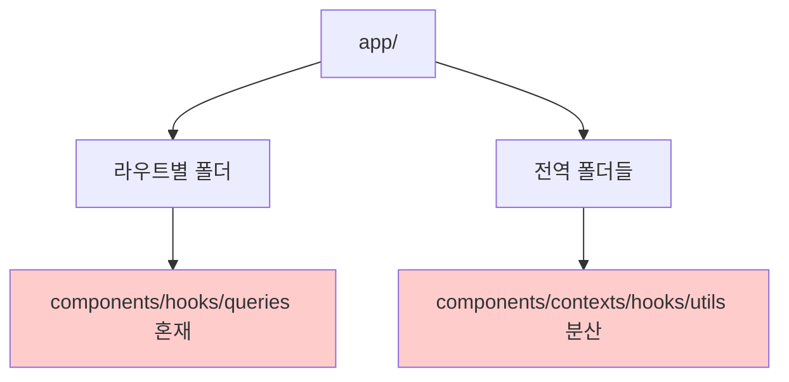
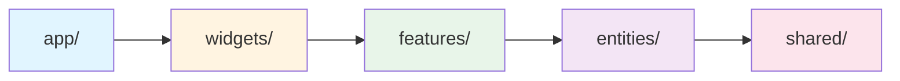

# FSD(Feature-Sliced Design) 마이그레이션 가이드

## 문서 개요

이 문서는 현재 Next.js App Router 기반 커스텀 아키텍처를 FSD(Feature-Sliced Design) 아키텍처로 점진적으로 마이그레이션하기 위한 가이드입니다.

**관련 이슈**: [#1 FSD 아키텍처 마이그레이션](https://github.com/jgjgill/my-speak/issues/1)
**참고 문서**:
- [FSD with Next.js Guide](https://feature-sliced.design/kr/docs/guides/tech/with-nextjs#app-router)
- [FSD Migration from Custom](https://feature-sliced.design/kr/docs/guides/migration/from-custom)

### 이슈-문서 역할 분리

**[GitHub Issue #1](https://github.com/jgjgill/my-speak/issues/1)**: 작업 진행 상황 추적 및 체크리스트

**이 문서**: 상세 설계 및 구현 가이드 (현재 구조 분석, FSD 레이어 매핑, 이동 대상 파일, 구조 정의)

---

## FSD 아키텍처 핵심

### 레이어 구조 (상위 → 하위)

```
app/      → widgets/ → features/ → entities/ → shared/
```

- **app**: Next.js 라우팅
- **widgets**: 복합 UI 블록 (features/entities 조합)
- **features**: 사용자 기능 (stage-1~4, audio-recorder, TTS)
- **entities**: 비즈니스 엔티티 (topic, user, progress)
- **shared**: 공통 코드 (ui, lib, api, config)

### 핵심 원칙

1. **의존성 방향**: 상위 레이어 → 하위 레이어만 가능
2. **슬라이스 독립성**: 같은 레이어끼리 직접 import 불가
3. **Public API**: `index.ts`로만 공개

---

## 현재 구조 분석

### 현재 구조 (Before)

```
app/
├── [language]/topics/[id]/
│   ├── components/  # UI, Stage 컴포넌트, TTS, 오디오 등 혼재
│   ├── hooks/       # 데이터 페칭, 상태 관리 등 혼재
│   ├── queries/     # TanStack Query
│   ├── mutations/   # TanStack Query 뮤테이션
│   ├── utils/       # 유틸리티
│   └── page.tsx
├── components/      # 전역 공통 컴포넌트
├── contexts/        # React Context
├── hooks/           # 전역 훅
├── utils/           # Supabase, 플랫폼 등
└── constants/       # 상수
```



**문제점**: 레이어 혼재, 의존성 불명확, 재사용성 부족, 확장성 제약

---

## FSD 목표 구조 (After)

### 목표 구조

```
src/
├── app/                    # Next.js 라우팅 (기존 app/)
├── widgets/                # 복합 UI
│   ├── topic-header/
│   └── stage-navigation/
├── features/               # 사용자 기능
│   ├── stage-one/
│   ├── stage-two/
│   ├── audio-recorder/
│   └── text-to-speech/
├── entities/               # 비즈니스 엔티티
│   ├── topic/
│   ├── user/
│   └── progress/
└── shared/                 # 공통 코드
    ├── api/        # Supabase, Query
    ├── lib/        # 유틸리티
    ├── ui/         # 공통 UI
    ├── config/     # 상수
    └── model/      # Context
```



### 레이어별 매핑

| 현재 | FSD | 예시 |
|------|-----|------|
| `app/utils/supabase/` | `shared/api/` | Supabase 클라이언트 |
| `app/constants/` | `shared/config/` | 언어 정보 |
| `app/contexts/` | `shared/model/` | Context |
| `app/[id]/queries/` | `entities/topic/api/` | Topic API |
| `app/[id]/components/stage-*` | `features/stage-*/` | Stage 기능 |
| `app/[id]/components/topic-header` | `widgets/topic-header/` | 복합 UI |

---

## 마이그레이션 원칙

1. **점진적 마이그레이션**: 레이어별로 단계적 진행
2. **문서-코드 동기화**: 작업 진행에 따라 이 문서를 실시간 업데이트
3. **기능 변경 금지**: 구조만 개선, 동작은 유지
4. **테스트 유지**: 모든 테스트 통과 보장

### TypeScript Path Alias 설정

```json
// tsconfig.json
{
  "compilerOptions": {
    "paths": {
      "@/app/*": ["./src/app/*"],
      "@/widgets/*": ["./src/widgets/*"],
      "@/features/*": ["./src/features/*"],
      "@/entities/*": ["./src/entities/*"],
      "@/shared/*": ["./src/shared/*"]
    }
  }
}
```

---

## 단계별 마이그레이션 로드맵

### 1단계: Shared Layer 구축 ✅ **완료**

#### 최종 구조

```
src/shared/
├── api/
│   └── supabase/           # Supabase 클라이언트 (client, server, middleware)
├── lib/
│   ├── auth/               # 인증 유틸리티 + Context
│   │   ├── server.ts       # getCurrentUser 등
│   │   ├── auth-context.ts # AuthContext + useAuth
│   │   └── index.ts
│   ├── toast/              # Toast Context
│   │   ├── toast-context.ts
│   │   └── index.ts
│   ├── webview/            # WebView Context
│   │   ├── webview-context.ts
│   │   └── index.ts
│   ├── platform/           # 플랫폼 감지
│   │   ├── server.ts
│   │   ├── client.ts
│   │   └── index.ts
│   ├── deep-link.ts        # 딥링크 유틸
│   ├── tts-bridge.ts       # TTS 브릿지
│   ├── use-is-mounted.ts   # 마운트 체크 훅
│   ├── create-safe-context.ts  # Context 유틸리티
│   └── index.ts
├── config/
│   ├── languages.ts        # 언어 상수
│   └── index.ts
└── ui/
    ├── modal/              # 모달 컴포넌트
    ├── toast/              # 토스트 컴포넌트
    ├── auth-button.tsx
    ├── conditional-header.tsx
    ├── google-analytics.tsx
    ├── native-bridge.tsx
    ├── structured-data.tsx
    └── index.ts

src/app/providers/          # Provider 컴포넌트 (App 레이어)
├── auth-provider.tsx       # AuthProvider 로직
├── toast-provider.tsx      # ToastProvider 로직
├── webview-provider.tsx    # WebViewProvider 로직
├── query-provider.tsx      # TanStack Query Provider
└── index.ts
```

#### 핵심 결정사항

**1. Context와 Provider 분리 (FSD 원칙 준수)**
- **Context 정의 + Hook**: `shared/lib/{auth,toast,webview}/`
- **Provider 로직**: `app/providers/`
- `createSafeContext` 유틸리티로 보일러플레이트 제거

**2. 단일 파일 vs 폴더 구조**
- 단일 파일: 폴더 없이 직접 파일 (예: `deep-link.ts`, `tts-bridge.ts`)
- 확장 가능성 있는 것: 폴더로 구성 (예: `auth/`, `platform/`)
- **FSD 원칙**: "what"이 아닌 "why" 기반 네이밍

**3. 의존성 방향**
- ✅ `shared/ui` → `shared/lib` (Context hook 사용)
- ❌ `shared` → `app` (FSD 위반 방지)

#### 검증 완료
- ✅ TypeScript 타입 체크: 0 에러
- ✅ Biome 린트/포맷: 통과
- ✅ Public API 패턴: 모든 슬라이스에 `index.ts` 구성

---

### 2단계: Entities Layer 구축

```
src/entities/
├── topic/      # api/, model/, ui/
├── user/       # api/, model/, ui/
└── progress/   # api/, model/, ui/
```

**슬라이스 구조** (예: topic):
```
topic/
├── index.ts    # Public API
├── api/        # get-topic, get-topics
├── model/      # types, hooks
└── ui/         # topic-card
```

**이동 대상**:
- `app/[id]/queries/topic-info-queries.ts` → `entities/topic/api/`
- `app/topics/components/topic-card.tsx` → `entities/topic/ui/`
- `app/hooks/use-user.ts` → `entities/user/model/`

---

### 3단계: Features Layer 구축

```
src/features/
├── stage-one/        # 1단계: 한글 문장
├── stage-two/        # 2단계: 영어/끊어읽기
├── stage-three/      # 3단계: 자유연습
├── stage-four/       # 4단계: 키워드 스피치
├── audio-recorder/   # 오디오 녹음
└── text-to-speech/   # TTS
```

**슬라이스 구조** (예: stage-one):
```
stage-one/
├── index.ts
├── ui/       # stage-one-container, korean-sentence-highlighter
├── model/    # use-stage-one-data
└── api/      # queries
```

**이동 대상**:
- `app/[id]/components/stage-one-container.tsx` → `features/stage-one/ui/`
- `app/[id]/components/audio-recorder/` → `features/audio-recorder/ui/`
- `app/[id]/components/tts/` → `features/text-to-speech/ui/`

---

### 4단계: Widgets Layer 구축

```
src/widgets/
├── topic-header/          # topic-header, skeleton
├── stage-navigation/      # navigation, stage-button
└── topic-client-wrapper/  # wrapper, skeleton, use-topic
```

**이동 대상**:
- `app/[id]/components/topic-header.tsx` → `widgets/topic-header/ui/`
- `app/[id]/components/stage-navigation.tsx` → `widgets/stage-navigation/ui/`
- `app/[id]/components/topic-client-wrapper.tsx` → `widgets/topic-client-wrapper/ui/`

---

### 5단계: Pages/App Layer 정리

**페이지 컴포넌트 단순화**:

```tsx
// Before: 비즈니스 로직 포함
// After: widgets 조합만

export default async function TopicDetailPage({ params }) {
  const { id } = await params;
  return (
    <>
      <TopicHeader topicId={id} />
      <TopicClientWrapper topicId={id} />
      <FloatingAppButton />
    </>
  );
}
```

**유지**: `app/layout.tsx`, `app/providers/`, `app/middleware.ts`

---

## 주의사항

1. **Next.js 호환**: `app/`는 Next.js 예약 디렉토리 → FSD는 `src/` 내부에 구축
2. **Public API**: 각 슬라이스는 `index.ts`로만 export
3. **의존성 방향**: 상위 → 하위만 허용
4. **슬라이스 독립성**: 같은 레이어끼리 직접 import 금지

---

## 참고 자료

### FSD 공식 문서
- [FSD 공식 사이트 (한글)](https://feature-sliced.design/kr/)
- [FSD with Next.js](https://feature-sliced.design/kr/docs/guides/tech/with-nextjs)
- [FSD Migration Guide](https://feature-sliced.design/kr/docs/guides/migration/from-custom)

### 관련 프로젝트 문서
- [TanStack Query 아키텍처](./tanstack-query-architecture.md)
- [WebView 연동 아키텍처](../../docs/development/webview-integration-architecture.md)
- [Supabase 아키텍처 설계](./supabase-architecture.md)

---
