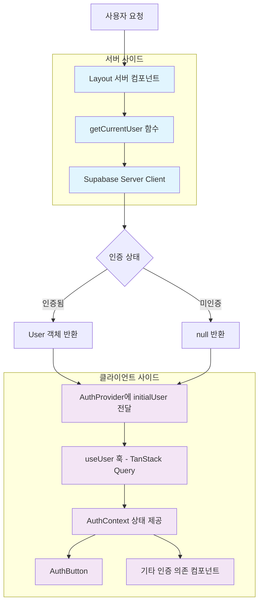
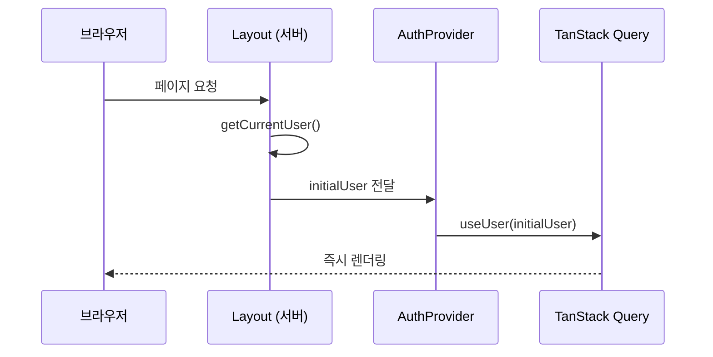
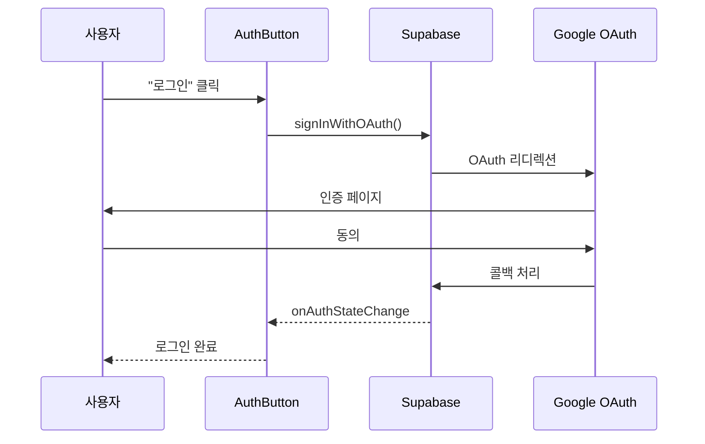
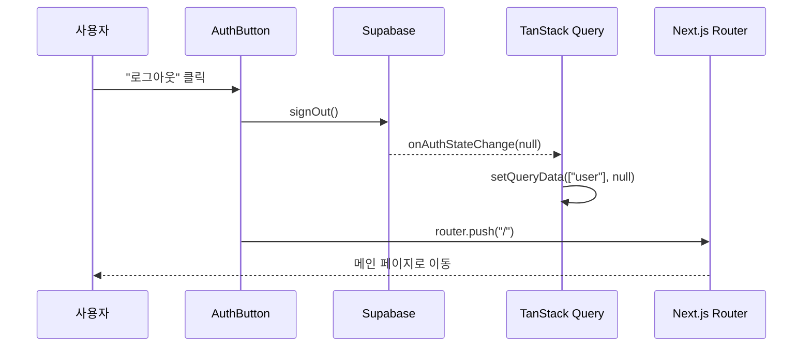

# 인증/인가 아키텍처

## 개요

서버 사이드에서 초기 인증 상태를 판별하고, TanStack Query를 통해 클라이언트 사이드에서 상태를 관리하는 인증 시스템입니다.

## 아키텍처 구성도



## 핵심 구현 요소

### 1. 서버 사이드 인증 유틸리티

**파일**: `apps/web/app/utils/auth/server.ts`

```typescript
import type { User } from "@supabase/supabase-js";
import { createClient } from "../supabase/server";

export async function getCurrentUser(): Promise<User | null> {
	try {
		const supabase = await createClient();
		const {
			data: { user },
			error,
		} = await supabase.auth.getUser();

		if (error) {
			console.log("User not authenticated:", error.message);
			return null;
		}

		return user;
	} catch (error) {
		console.error("Error getting user:", error);
		return null;
	}
}

export async function isAuthenticated(): Promise<boolean> {
	const user = await getCurrentUser();
	return user !== null;
}
```

### 2. TanStack Query 기반 사용자 상태 관리

**파일**: `apps/web/app/hooks/use-user.ts`

```typescript
import type { User } from "@supabase/supabase-js";
import { useQuery } from "@tanstack/react-query";
import { createClient } from "../utils/supabase/client";

async function getUser(): Promise<User | null> {
	const supabase = createClient();
	const { data, error } = await supabase.auth.getUser();

	if (error) {
		console.log("User not authenticated:", error.message);
		return null;
	}
	return data.user;
}

export function useUser(initialUser?: User | null) {
	return useQuery({
		queryKey: ["user"],
		queryFn: getUser,
		staleTime: 15 * 60 * 1000,     // 15분 캐시
		gcTime: Infinity,              // 세션 동안 유지
		initialData: initialUser,      // 서버 초기 데이터
	});
}
```

### 3. AuthProvider 컨텍스트

**파일**: `apps/web/app/contexts/auth-context.tsx`

```typescript
interface AuthContextType {
	user: User | null;
	isLoading: boolean;
	signInWithGoogle: () => Promise<void>;
	signOut: () => Promise<void>;
}

export function AuthProvider({
	children,
	initialUser = null,
}: AuthProviderProps) {
	const { data: user = null, isLoading } = useUser(initialUser);
	const queryClient = useQueryClient();
	const router = useRouter();
	const supabase = createClient();

	useEffect(() => {
		const {
			data: { subscription },
		} = supabase.auth.onAuthStateChange(async (_event, session) => {
			queryClient.setQueryData(["user"], session?.user ?? null);
		});

		return () => subscription.unsubscribe();
	}, [supabase.auth, queryClient]);

	const signInWithGoogle = async () => {
		const { error } = await supabase.auth.signInWithOAuth({
			provider: "google",
			options: {
				redirectTo: `${location.origin}/auth/callback`,
			},
		});

		if (error) {
			console.error("Google 로그인 실패:", error.message);
		}
	};

	const signOut = async () => {
		const { error } = await supabase.auth.signOut();

		if (error) {
			console.error("로그아웃 실패:", error.message);
		} else {
			router.push("/");
		}
	};

	return (
		<AuthContext.Provider value={{ user, isLoading, signInWithGoogle, signOut }}>
			{children}
		</AuthContext.Provider>
	);
}
```

### 4. Layout 컴포넌트

**파일**: `apps/web/app/layout.tsx`

```typescript
export default async function Layout({ children }: PropsWithChildren) {
	const initialUser = await getCurrentUser();
	
	return (
		<html lang="ko">
			<body>
				<QueryProvider>
					<AuthProvider initialUser={initialUser}>
						<header className="border-b bg-white h-16">
							<div className="max-w-6xl mx-auto px-4 py-3 flex justify-between items-center">
								<h1 className="text-xl font-bold">
									<Link href="/" className="hover:text-blue-600">
										My Speak
									</Link>
								</h1>
								<AuthButton />
							</div>
						</header>
						<main>{children}</main>
					</AuthProvider>
				</QueryProvider>
			</body>
		</html>
	);
}
```

## 인증 플로우

### 초기 로딩



### 로그인



### 로그아웃



## 사용법

### 서버 컴포넌트

```typescript
import { getCurrentUser } from "../../utils/auth/server";

export default async function ServerPage() {
	const user = await getCurrentUser();
	
	return (
		<div>
			{user ? `안녕하세요, ${user.email}님` : "로그인이 필요합니다"}
		</div>
	);
}
```

### 클라이언트 컴포넌트

```typescript
import { useAuth } from "../contexts/auth-context";

export default function ClientComponent() {
	const { user, isLoading, signInWithGoogle } = useAuth();
	
	if (isLoading) return <div>로딩 중...</div>;
	
	return (
		<div>
			{user ? (
				<span>{user.email}</span>
			) : (
				<button onClick={signInWithGoogle}>로그인</button>
			)}
		</div>
	);
}
```

## 파일 구조

```
apps/web/app/
├── utils/auth/
│   └── server.ts              # 서버 사이드 인증
├── hooks/
│   └── use-user.ts           # TanStack Query 사용자 상태
├── contexts/
│   └── auth-context.tsx       # AuthProvider & useAuth
├── components/
│   └── auth-button.tsx        # 인증 버튼
├── auth/callback/
│   └── route.ts              # OAuth 콜백
└── layout.tsx                 # 루트 레이아웃
```

## 주요 특징

- **Hydration 안정성**: 서버 초기 데이터로 클라이언트/서버 일관성 보장
- **캐싱 효율성**: TanStack Query의 15분 stale time으로 API 호출 최소화
- **실시간 동기화**: onAuthStateChange 리스너로 상태 변경 실시간 반영
- **관심사 분리**: 서버/클라이언트/캐싱 로직이 각각 분리된 구조