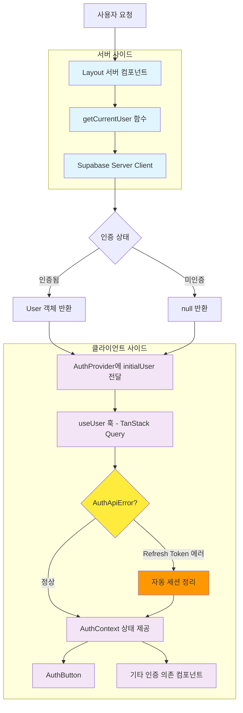
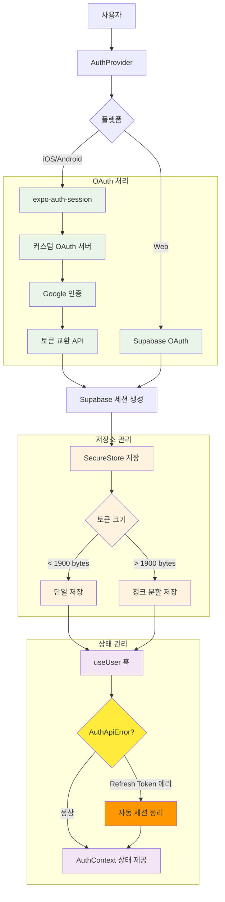
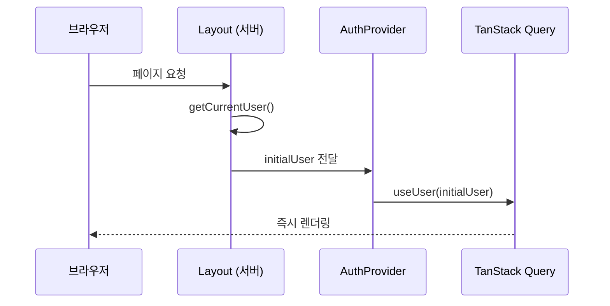
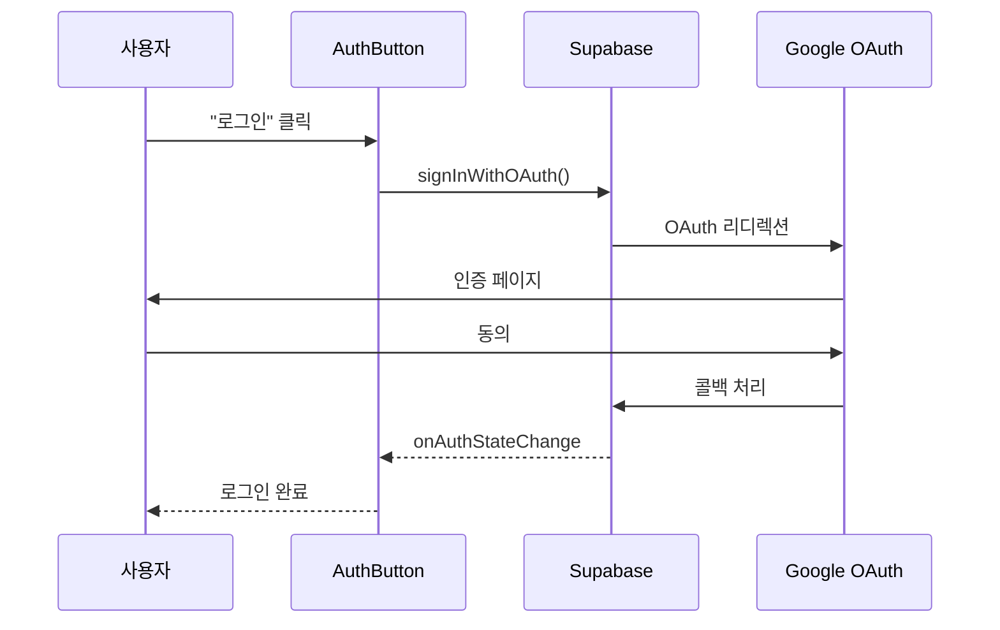
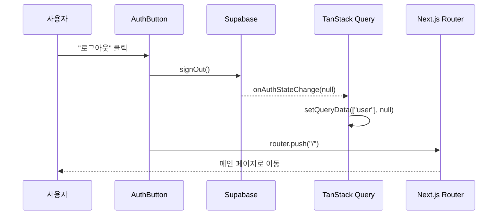

# 인증 아키텍처

## 개요

웹앱과 네이티브앱 모두 Supabase + TanStack Query 기반의 통합 인증 시스템을 사용합니다. 웹앱은 서버 사이드 초기 인증 상태 판별을, 네이티브앱은 SecureStore 기반 세션 지속성을 제공합니다.

## 웹앱 아키텍처 구성도



## 네이티브앱 아키텍처 구성도



## 핵심 구현 요소

### 서버 사이드 인증 (`apps/web/app/utils/auth/server.ts`)
```typescript
export async function getCurrentUser(): Promise<User | null> {
    const supabase = await createClient();
    const { data: { user }, error } = await supabase.auth.getUser();
    return error ? null : user;
}
```

### 2. TanStack Query 기반 사용자 상태 관리 (AuthApiError 처리 포함)

**파일**: `apps/web/app/hooks/use-user.ts`

```typescript
import type { User } from "@supabase/supabase-js";
import { useQuery } from "@tanstack/react-query";
import { createClient } from "../utils/supabase/client";

async function getUser(): Promise<User | null> {
	try {
		const supabase = createClient();
		const { data, error } = await supabase.auth.getUser();

		if (error) {
			console.log("🚫 User authentication failed:", {
				message: error.message,
				status: error.status,
				name: error.name
			});
			
			// AuthApiError이고 refresh token 관련 에러인 경우 세션 정리
			if (error.name === 'AuthApiError' && error.message.includes('refresh')) {
				console.log("🔄 Refresh token error detected, clearing session...");
				await supabase.auth.signOut();
			}
			
			return null;
		}
		return data.user;
	} catch (error) {
		console.error("💥 Unexpected error in getUser:", {
			error: error instanceof Error ? error.message : error,
			stack: error instanceof Error ? error.stack : undefined
		});
		return null;
	}
}

export function useUser(initialUser?: User | null) {
	return useQuery({
		queryKey: ["user"],
		queryFn: getUser,
		staleTime: 15 * 60 * 1000,     // 15분 캐시
		gcTime: Infinity,              // 세션 동안 유지
		initialData: initialUser,      // 서버 초기 데이터
		retry: false,                  // 인증 실패시 재시도 안함
	});
}
```

### 3. AuthProvider 컨텍스트

**파일**: `apps/web/app/contexts/auth-context.tsx`

```typescript
interface AuthContextType {
	user: User | null;
	isLoading: boolean;
	signInWithGoogle: () => Promise<void>;
	signOut: () => Promise<void>;
}

export function AuthProvider({
	children,
	initialUser = null,
}: AuthProviderProps) {
	const { data: user = null, isLoading } = useUser(initialUser);
	const queryClient = useQueryClient();
	const router = useRouter();
	const supabase = createClient();

	useEffect(() => {
		const {
			data: { subscription },
		} = supabase.auth.onAuthStateChange(async (_event, session) => {
			queryClient.setQueryData(["user"], session?.user ?? null);
		});

		return () => subscription.unsubscribe();
	}, [supabase.auth, queryClient]);

	const signInWithGoogle = async () => {
		const { error } = await supabase.auth.signInWithOAuth({
			provider: "google",
			options: {
				redirectTo: `${location.origin}/auth/callback`,
			},
		});

		if (error) {
			console.error("Google 로그인 실패:", error.message);
		}
	};

	const signOut = async () => {
		const { error } = await supabase.auth.signOut();

		if (error) {
			console.error("로그아웃 실패:", error.message);
		} else {
			router.push("/");
		}
	};

	return (
		<AuthContext.Provider value={{ user, isLoading, signInWithGoogle, signOut }}>
			{children}
		</AuthContext.Provider>
	);
}
```

### Layout 컴포넌트 (`apps/web/app/layout.tsx`)
```typescript
export default async function Layout({ children }: PropsWithChildren) {
    const initialUser = await getCurrentUser();
    
    return (
        ...
        <AuthProvider initialUser={initialUser}>
            {children}
        </AuthProvider>
        ...
    );
}
```

## 인증 플로우

### 초기 로딩



### 로그인



### 로그아웃




## 플랫폼별 이슈 및 해결책

### 네이티브 앱 네비게이션 문제

#### 문제 상황
- **iOS Apple 로그인**: 네이티브 모달 방식으로 진행되어 `router.dismissAll()` 시 "go_back was not handled" 에러 발생
- **Android**: `router.replace("/")` 사용 시 화면 재렌더링으로 인한 깜빡임 발생

#### 해결책
**파일**: `apps/native/hooks/use-auth-state-effect.ts`

```typescript
if (event === "SIGNED_IN") {
    if (Platform.OS === "android") {
        // 안드로이드: dismissAll로 깔끔한 스택 정리 (replace 시 깜빡임 발생)
        router.dismissAll();
    } else {
        // iOS: Apple 로그인 모달 때문에 replace 사용 (dismissAll 시 네비게이션 에러)
        router.replace("/");
    }
}
```

### 인증 세션 에러 처리

#### 문제 상황
- **AuthSessionMissingError**: 서버 로그아웃 실패 시 로컬 사용자 상태가 남아있음
- **토큰 만료**: 네트워크 문제로 세션 갱신 실패 시 불일치 상태 발생

#### 해결책
**웹/네이티브 공통 처리**:

```typescript
const signOut = async () => {
    const { error } = await supabase.auth.signOut();
    
    if (error) {
        console.error("로그아웃 실패:", error.message);
        // Auth session missing 등의 경우 query client만 초기화
        queryClient.setQueryData(["user"], null);
        queryClient.clear();
    }
    
    // 로그아웃 완료 후 네비게이션 처리
};
```