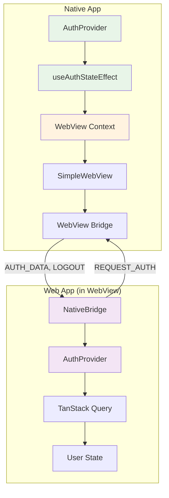
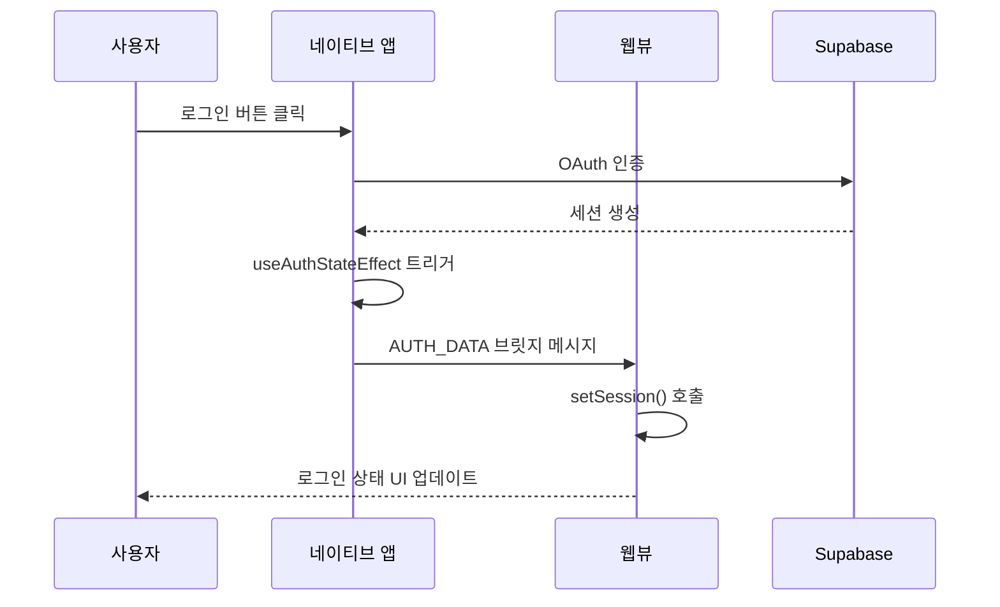
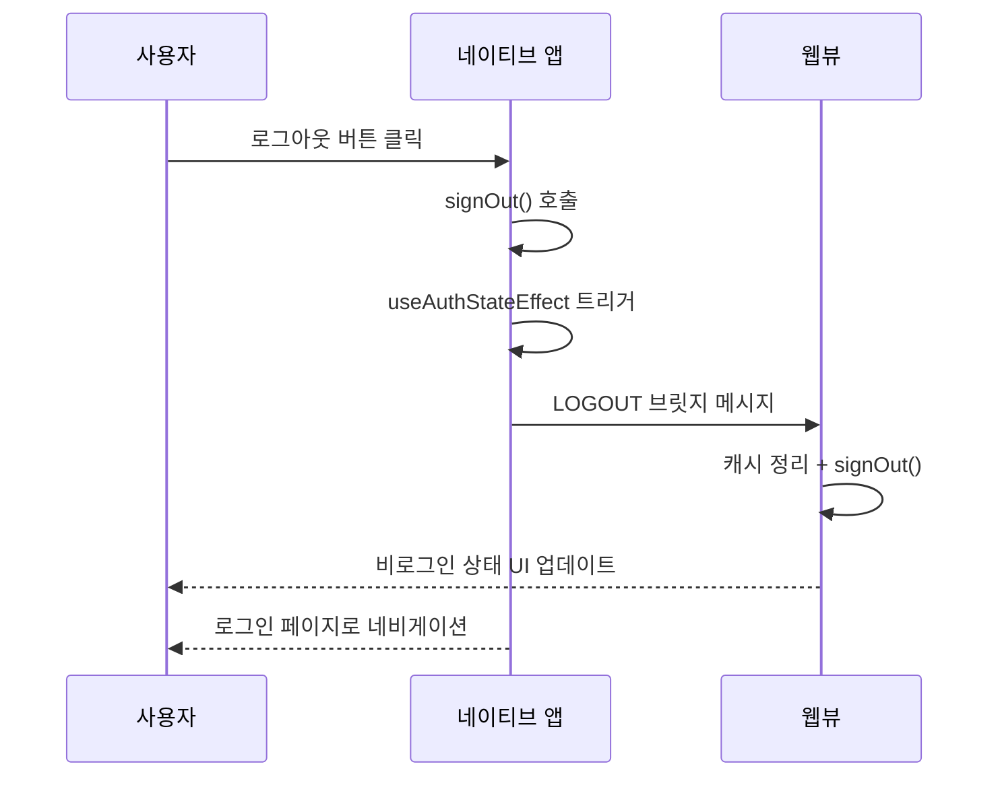

# 인증 아키텍처

## 개요

웹앱과 네이티브앱 모두 Supabase + TanStack Query 기반의 통합 인증 시스템을 사용합니다.

- **웹앱**: 서버 사이드 초기 인증 상태 판별 + WebView 브릿지 통신
- **네이티브앱**: OAuth 인증 + WebView 세션 동기화 + 전역 WebView Context 관리

## 네이티브-웹뷰 통합 아키텍처



## 핵심 구현 요소

### 1. 네이티브 앱 전역 WebView Context

**파일**: `apps/native/context/webview-context.tsx`
```typescript
export function WebViewProvider({ children }: PropsWithChildren) {
  const webViewRef = useRef<WebView>(null);
  
  return (
    <WebViewContext.Provider value={{ webViewRef }}>
      {children}
    </WebViewContext.Provider>
  );
}
```

**Provider 계층구조**: `apps/native/app/_layout.tsx`
```typescript
<WebViewProvider>
  <AuthProvider>
    {/* WebView Context가 Auth보다 상위에 위치 */}
  </AuthProvider>
</WebViewProvider>
```

### 2. 인증 상태 변경 시 자동 브릿지 통신

**파일**: `apps/native/hooks/use-auth-state-effect.ts`
```typescript
useEffect(() => {
  const { data: { subscription } } = supabase.auth.onAuthStateChange(async (event, session) => {
    queryClient.setQueryData(["user"], session?.user ?? null);

    // 🔥 WebView 브릿지 통신 (네비게이션 전에 처리)
    if (webViewRef.current) {
      if (event === "SIGNED_IN" && session) {
        const authData = {
          type: "AUTH_DATA",
          user: { id: session.user.id, email: session.user.email },
          session: { access_token: session.access_token, refresh_token: session.refresh_token }
        };
        webViewRef.current.postMessage(JSON.stringify(authData));
      } else if (event === "SIGNED_OUT") {
        webViewRef.current.postMessage(JSON.stringify({ type: "LOGOUT" }));
      }
    }

    // 네비게이션 처리
    if (event === "SIGNED_IN") {
      if (Platform.OS === "ios") router.replace("/");
    } else if (event === "SIGNED_OUT") {
      queryClient.clear();
      router.dismissAll();
    }
  });

  return () => subscription.unsubscribe();
}, [queryClient, webViewRef]);
```

### 3. 웹뷰에서 초기 인증 요청

**파일**: `apps/native/components/simple-webview.tsx`
```typescript
const sendAuthToWebView = useCallback(async () => {
  if (ref && typeof ref === "object" && ref.current) {
    if (user) {
      // 로그인 상태: 세션 데이터 전송
      const { data: { session } } = await supabase.auth.getSession();
      const authData = {
        type: "AUTH_DATA",
        user: { id: user.id, email: user.email },
        session: session ? { access_token: session.access_token, refresh_token: session.refresh_token } : null
      };
      ref.current.postMessage(JSON.stringify(authData));
    } else {
      // 비로그인 상태: LOGOUT 메시지 전송
      ref.current.postMessage(JSON.stringify({ type: "LOGOUT" }));
    }
  }
}, [user, ref]);

// REQUEST_AUTH 메시지 처리
const handleWebViewMessage = (event: WebViewMessageEvent) => {
  const message = JSON.parse(event.nativeEvent.data);
  if (message.type === "REQUEST_AUTH") {
    sendAuthToWebView();
  }
};
```

### 4. 웹 앱 브릿지 메시지 처리

**파일**: `apps/web/app/components/native-bridge.tsx`
```typescript
const handleNativeMessage = (event: Event) => {
  const messageEvent = event as MessageEvent;
  const message = JSON.parse(messageEvent.data);
  
  if (message.type === "AUTH_DATA") {
    if (message.session) {
      const supabase = createClient();
      supabase.auth.setSession({
        access_token: message.session.access_token,
        refresh_token: message.session.refresh_token,
      });
    }
  } else if (message.type === "LOGOUT") {
    queryClient.setQueryData(["user"], null);
    queryClient.clear();
    
    const supabase = createClient();
    supabase.auth.signOut().catch(() => {
      console.log("Supabase signOut error ignored (session may already be cleared)");
    });
  }
};

// 웹뷰 로드 후 초기 인증 요청
const requestAuthFromNative = () => {
  if (window.ReactNativeWebView) {
    window.ReactNativeWebView.postMessage(JSON.stringify({ type: "REQUEST_AUTH" }));
  }
};
```

## 인증 플로우

### 로그인 플로우



### 로그아웃 플로우



## 에러 처리

### AuthSessionMissingError 처리

네이티브 앱과 웹뷰 모두에서 동일한 패턴으로 처리:

```typescript
// 즉시 캐시 정리 (UI 빠른 반응)
queryClient.setQueryData(["user"], null);
queryClient.clear();

// 서버 로그아웃 시도 (실패해도 무시)
supabase.auth.signOut().catch(() => {
  console.log("Supabase signOut error ignored (session may already be cleared)");
});
```

### 플랫폼별 네비게이션 처리

```typescript
if (event === "SIGNED_IN") {
  if (Platform.OS === "ios") {
    // iOS: Apple 로그인 모달 때문에 replace 사용
    router.replace("/");
  }
} else if (event === "SIGNED_OUT") {
  queryClient.clear();
  router.dismissAll();
}
```

## 주요 개선 사항

1. **중앙화된 브릿지 통신**: `useAuthStateEffect`에서 인증 상태 변경 시 자동으로 WebView와 동기화
2. **전역 WebView Context**: 컴포넌트 간 WebView ref 공유로 일관된 통신
3. **양방향 통신**: 네이티브↔웹뷰 간 REQUEST_AUTH, AUTH_DATA, LOGOUT 메시지 처리
4. **에러 처리 강화**: AuthSessionMissingError 시 안전한 세션 정리
5. **타이밍 이슈 해결**: 웹뷰 로드 후 초기 인증 상태 요청으로 동기화 보장