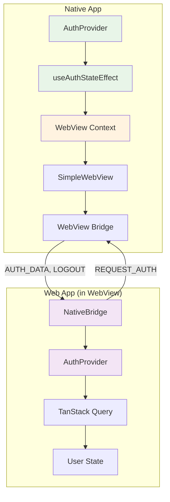
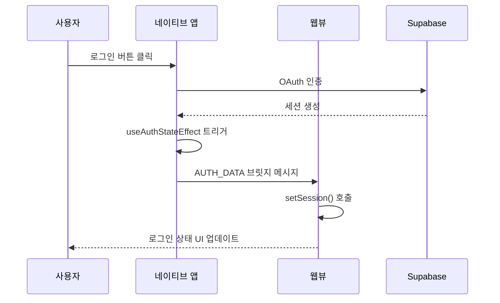
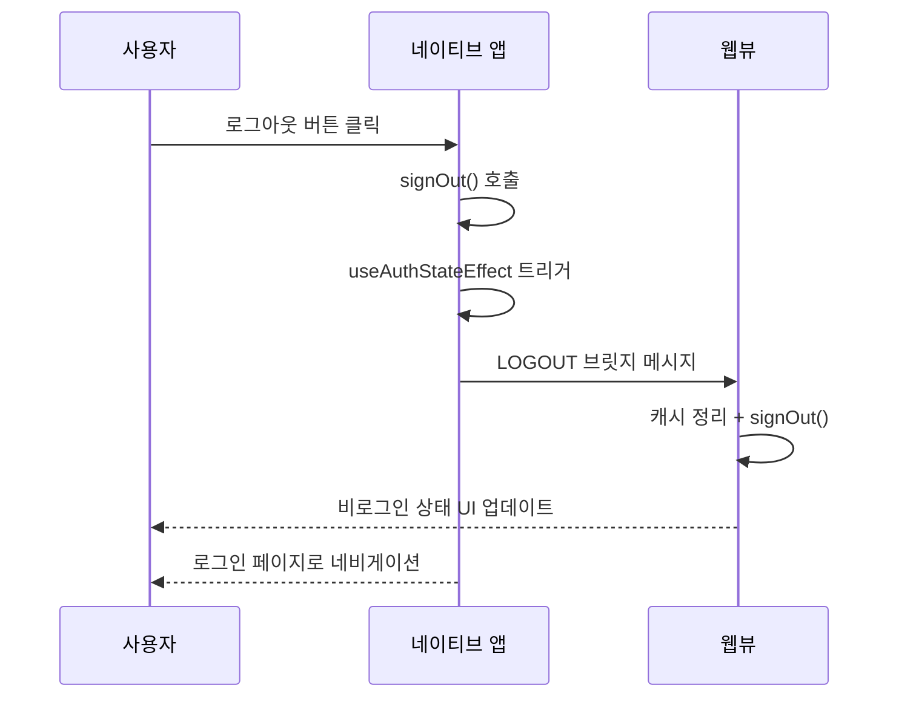

# 인증 아키텍처

## 개요

웹앱과 네이티브앱 모두 Supabase + TanStack Query 기반의 통합 인증 시스템을 사용합니다.

- **웹앱**: 서버 사이드 초기 인증 상태 판별 + WebView 브릿지 통신
- **네이티브앱**: OAuth 인증 + WebView 세션 동기화 + 전역 WebView Context 관리

## 네이티브-웹뷰 통합 아키텍처



## 핵심 구현 패턴

### 중앙화된 브릿지 통신

**`useAuthStateEffect`에서 인증 상태 변경 시 자동 처리**:

```typescript
// 1. TanStack Query 업데이트
queryClient.setQueryData(["user"], session?.user ?? null);

// 2. WebView 브릿지 통신 (네비게이션 전)
if (webViewRef.current) {
  if (event === "SIGNED_IN" && session) {
    webViewRef.current.postMessage(JSON.stringify({
      type: "AUTH_DATA",
      user: { id: session.user.id, email: session.user.email },
      session: { access_token, refresh_token }
    }));
  } else if (event === "SIGNED_OUT") {
    webViewRef.current.postMessage(JSON.stringify({ type: "LOGOUT" }));
  }
}

// 3. 네비게이션 처리
```

### 양방향 세션 동기화

**네이티브 → 웹**: 인증 상태 변경 시 자동 전송  
**웹 → 네이티브**: 초기 로드 시 `REQUEST_AUTH` 요청

### 브릿지 통신 안정성

**재시도 메커니즘**: AUTH 요청 실패 시 1초 간격 3회 재시도

**이중 캐시 정리**: NativeBridge와 AuthContext 양쪽에서 로그아웃 시 캐시 정리로 확실한 세션 종료

## 인증 플로우

### 로그인 플로우



### 로그아웃 플로우



## 에러 처리 패턴

### AuthSessionMissingError

서버에서 이미 세션이 만료되었거나 존재하지 않을 때 발생하는 에러입니다.

**공통 처리 패턴**:
```typescript
// 1. 즉시 캐시 정리 (UI 빠른 반응)
queryClient.setQueryData(["user"], null);
queryClient.clear();

// 2. 서버 로그아웃 시도 (실패해도 무시)
supabase.auth.signOut().catch(() => {
  console.log("Supabase signOut error ignored (session may already be cleared)");
});
```

### 네비게이션 패턴

**로그인 후**: `router.replace("/")` - 루트 화면으로 이동  
**로그아웃 후**: `router.dismissAll()` - 모든 스택 정리 후 깔끔한 초기화

## 주요 개선 사항

1. **🎯 중앙화된 브릿지 통신**: `useAuthStateEffect`에서 인증 상태 변경 시 자동으로 WebView와 동기화
2. **🌐 전역 WebView Context**: 컴포넌트 간 WebView ref 공유로 일관된 통신
3. **🔄 양방향 통신**: 네이티브↔웹뷰 간 REQUEST_AUTH, AUTH_DATA, LOGOUT 메시지 처리
4. **🛡️ 에러 처리 강화**: AuthSessionMissingError 시 안전한 세션 정리
5. **⏰ 타이밍 이슈 해결**: 웹뷰 로드 후 초기 인증 상태 요청으로 동기화 보장
6. **🔄 재시도 메커니즘**: AUTH 요청 실패 시 3회 재시도로 안정성 향상 
7. **🗑️ 완전한 세션 정리**: 로그아웃 시 네이티브와 웹뷰에서 이중 캐시 정리
8. **📍 네비게이션 최적화**: 로그인 후 `router.replace("/")`, 로그아웃 후 `router.dismissAll()` 적용

## 관련 문서

- [WebView 연동 아키텍처](webview-integration-architecture.md) - 브릿지 통신과 WebView 구성 상세 정보