# 인증 아키텍처

## 개요

웹앱과 네이티브앱 모두 Supabase + TanStack Query 기반의 통합 인증 시스템을 사용합니다. 웹앱은 서버 사이드 초기 인증 상태 판별을, 네이티브앱은 SecureStore 기반 세션 지속성을 제공합니다.

## 웹앱 아키텍처 구성도


## 네이티브앱 아키텍처 구성도

```mermaid
graph TD
    A[사용자] --> B[AuthProvider]
    B --> C{플랫폼}
    C -->|iOS/Android| D[expo-auth-session]
    C -->|Web| E[Supabase OAuth]
    
    D --> F[커스텀 OAuth 서버]
    F --> G[Google 인증]
    G --> H[토큰 교환 API]
    H --> I[Supabase 세션 생성]
    
    E --> I
    I --> J[SecureStore 저장]
    J --> K{토큰 크기}
    K -->|< 1900 bytes| L[단일 저장]
    K -->|> 1900 bytes| M[청크 분할 저장]
    
    L --> N[useUser 훅]
    M --> N
    N --> O{AuthApiError?}
    O -->|Refresh Token 에러| P[자동 세션 정리]
    O -->|정상| Q[AuthContext 상태 제공]
    P --> Q
    
    subgraph "OAuth 처리"
        D
        E
        F
        G
        H
        style D fill:#e8f5e8
        style E fill:#e8f5e8
        style F fill:#e8f5e8
        style G fill:#e8f5e8
        style H fill:#e8f5e8
    end
    
    subgraph "저장소 관리"
        J
        K
        L
        M
        style J fill:#fff3e0
        style K fill:#fff3e0
        style L fill:#fff3e0
        style M fill:#fff3e0
    end
    
    subgraph "상태 관리"
        N
        O
        P
        Q
        style N fill:#f3e5f5
        style O fill:#ffeb3b
        style P fill:#ff9800
        style Q fill:#f3e5f5
    end
```



## 핵심 구현 요소

### 1. 서버 사이드 인증 유틸리티

**파일**: `apps/web/app/utils/auth/server.ts`

```typescript
import type { User } from "@supabase/supabase-js";
import { createClient } from "../supabase/server";

export async function getCurrentUser(): Promise<User | null> {
	try {
		const supabase = await createClient();
		const {
			data: { user },
			error,
		} = await supabase.auth.getUser();

		if (error) {
			console.log("User not authenticated:", error.message);
			return null;
		}

		return user;
	} catch (error) {
		console.error("Error getting user:", error);
		return null;
	}
}

export async function isAuthenticated(): Promise<boolean> {
	const user = await getCurrentUser();
	return user !== null;
}
```

### 2. TanStack Query 기반 사용자 상태 관리 (AuthApiError 처리 포함)

**파일**: `apps/web/app/hooks/use-user.ts`

```typescript
import type { User } from "@supabase/supabase-js";
import { useQuery } from "@tanstack/react-query";
import { createClient } from "../utils/supabase/client";

async function getUser(): Promise<User | null> {
	try {
		const supabase = createClient();
		const { data, error } = await supabase.auth.getUser();

		if (error) {
			console.log("🚫 User authentication failed:", {
				message: error.message,
				status: error.status,
				name: error.name
			});
			
			// AuthApiError이고 refresh token 관련 에러인 경우 세션 정리
			if (error.name === 'AuthApiError' && error.message.includes('refresh')) {
				console.log("🔄 Refresh token error detected, clearing session...");
				await supabase.auth.signOut();
			}
			
			return null;
		}
		return data.user;
	} catch (error) {
		console.error("💥 Unexpected error in getUser:", {
			error: error instanceof Error ? error.message : error,
			stack: error instanceof Error ? error.stack : undefined
		});
		return null;
	}
}

export function useUser(initialUser?: User | null) {
	return useQuery({
		queryKey: ["user"],
		queryFn: getUser,
		staleTime: 15 * 60 * 1000,     // 15분 캐시
		gcTime: Infinity,              // 세션 동안 유지
		initialData: initialUser,      // 서버 초기 데이터
		retry: false,                  // 인증 실패시 재시도 안함
	});
}
```

### 3. AuthProvider 컨텍스트

**파일**: `apps/web/app/contexts/auth-context.tsx`

```typescript
interface AuthContextType {
	user: User | null;
	isLoading: boolean;
	signInWithGoogle: () => Promise<void>;
	signOut: () => Promise<void>;
}

export function AuthProvider({
	children,
	initialUser = null,
}: AuthProviderProps) {
	const { data: user = null, isLoading } = useUser(initialUser);
	const queryClient = useQueryClient();
	const router = useRouter();
	const supabase = createClient();

	useEffect(() => {
		const {
			data: { subscription },
		} = supabase.auth.onAuthStateChange(async (_event, session) => {
			queryClient.setQueryData(["user"], session?.user ?? null);
		});

		return () => subscription.unsubscribe();
	}, [supabase.auth, queryClient]);

	const signInWithGoogle = async () => {
		const { error } = await supabase.auth.signInWithOAuth({
			provider: "google",
			options: {
				redirectTo: `${location.origin}/auth/callback`,
			},
		});

		if (error) {
			console.error("Google 로그인 실패:", error.message);
		}
	};

	const signOut = async () => {
		const { error } = await supabase.auth.signOut();

		if (error) {
			console.error("로그아웃 실패:", error.message);
		} else {
			router.push("/");
		}
	};

	return (
		<AuthContext.Provider value={{ user, isLoading, signInWithGoogle, signOut }}>
			{children}
		</AuthContext.Provider>
	);
}
```

### 4. Layout 컴포넌트

**파일**: `apps/web/app/layout.tsx`

```typescript
export default async function Layout({ children }: PropsWithChildren) {
	const initialUser = await getCurrentUser();
	
	return (
		<html lang="ko">
			<body>
				<QueryProvider>
					<AuthProvider initialUser={initialUser}>
						<header className="border-b bg-white h-16">
							<div className="max-w-6xl mx-auto px-4 py-3 flex justify-between items-center">
								<h1 className="text-xl font-bold">
									<Link href="/" className="hover:text-blue-600">
										My Speak
									</Link>
								</h1>
								<AuthButton />
							</div>
						</header>
						<main>{children}</main>
					</AuthProvider>
				</QueryProvider>
			</body>
		</html>
	);
}
```

## 인증 플로우

### 초기 로딩

```mermaid
sequenceDiagram
    participant Browser as 브라우저
    participant Layout as Layout (서버)
    participant Auth as AuthProvider
    participant Query as TanStack Query

    Browser->>Layout: 페이지 요청
    Layout->>Layout: getCurrentUser()
    Layout->>Auth: initialUser 전달
    Auth->>Query: useUser(initialUser)
    Query-->>Browser: 즉시 렌더링
```



### 로그인

```mermaid
sequenceDiagram
    participant User as 사용자
    participant AuthButton as AuthButton
    participant Supabase as Supabase
    participant Google as Google OAuth

    User->>AuthButton: "로그인" 클릭
    AuthButton->>Supabase: signInWithOAuth()
    Supabase->>Google: OAuth 리디렉션
    Google->>User: 인증 페이지
    User->>Google: 동의
    Google->>Supabase: 콜백 처리
    Supabase-->>AuthButton: onAuthStateChange
    AuthButton-->>User: 로그인 완료
```



### 로그아웃

```mermaid
sequenceDiagram
    participant User as 사용자
    participant AuthButton as AuthButton
    participant Supabase as Supabase
    participant Query as TanStack Query
    participant Router as Next.js Router

    User->>AuthButton: "로그아웃" 클릭
    AuthButton->>Supabase: signOut()
    Supabase-->>Query: onAuthStateChange(null)
    Query->>Query: setQueryData(["user"], null)
    AuthButton->>Router: router.push("/")
    Router-->>User: 메인 페이지로 이동
```



## 사용법

### 서버 컴포넌트

```typescript
import { getCurrentUser } from "../../utils/auth/server";

export default async function ServerPage() {
	const user = await getCurrentUser();
	
	return (
		<div>
			{user ? `안녕하세요, ${user.email}님` : "로그인이 필요합니다"}
		</div>
	);
}
```

### 클라이언트 컴포넌트

```typescript
import { useAuth } from "../contexts/auth-context";

export default function ClientComponent() {
	const { user, isLoading, signInWithGoogle } = useAuth();
	
	if (isLoading) return <div>로딩 중...</div>;
	
	return (
		<div>
			{user ? (
				<span>{user.email}</span>
			) : (
				<button onClick={signInWithGoogle}>로그인</button>
			)}
		</div>
	);
}
```

## 파일 구조

```
apps/web/app/
├── utils/auth/
│   └── server.ts              # 서버 사이드 인증
├── hooks/
│   └── use-user.ts           # TanStack Query 사용자 상태
├── contexts/
│   └── auth-context.tsx       # AuthProvider & useAuth
├── components/
│   └── auth-button.tsx        # 인증 버튼
├── auth/callback/
│   └── route.ts              # OAuth 콜백
└── layout.tsx                 # 루트 레이아웃
```

## 주요 특징

- **Hydration 안정성**: 서버 초기 데이터로 클라이언트/서버 일관성 보장
- **캐싱 효율성**: TanStack Query의 15분 stale time으로 API 호출 최소화
- **실시간 동기화**: onAuthStateChange 리스너로 상태 변경 실시간 반영
- **관심사 분리**: 서버/클라이언트/캐싱 로직이 각각 분리된 구조