# 인증 아키텍처

## 개요

웹앱과 네이티브앱 모두 Supabase + TanStack Query 기반의 통합 인증 시스템을 사용합니다.

- **웹앱**: 서버 사이드 초기 인증 상태 판별 + WebView 브릿지 통신
- **네이티브앱**: OAuth 인증 + WebView 세션 동기화 + 전역 WebView Context 관리

## 네이티브-웹뷰 통합 아키텍처


## 핵심 구현 패턴

### 중앙화된 브릿지 통신

**`useAuthStateEffect`에서 인증 상태 변경 시 자동 처리**:

```typescript
// 1. TanStack Query 업데이트
queryClient.setQueryData(["user"], session?.user ?? null);

// 2. WebView 브릿지 통신 (네비게이션 전)
if (webViewRef.current) {
  if (event === "SIGNED_IN" && session) {
    webViewRef.current.postMessage(JSON.stringify({
      type: "AUTH_DATA",
      user: { id: session.user.id, email: session.user.email },
      session: { access_token, refresh_token }
    }));
  } else if (event === "SIGNED_OUT") {
    webViewRef.current.postMessage(JSON.stringify({ type: "LOGOUT" }));
  }
}

// 3. 네비게이션 처리
```

### 양방향 세션 동기화

**네이티브 → 웹**: 인증 상태 변경 시 자동 전송  
**웹 → 네이티브**: 초기 로드 시 `REQUEST_AUTH` 요청

## 인증 플로우

### 로그인 플로우

```mermaid
sequenceDiagram
    participant User as 사용자
    participant Native as 네이티브 앱
    participant WebView as 웹뷰
    participant Supabase as Supabase
    
    User->>Native: 로그인 버튼 클릭
    Native->>Supabase: OAuth 인증
    Supabase-->>Native: 세션 생성
    Native->>Native: useAuthStateEffect 트리거
    Native->>WebView: AUTH_DATA 브릿지 메시지
    WebView->>WebView: setSession() 호출
    WebView-->>User: 로그인 상태 UI 업데이트
```



### 로그아웃 플로우

```mermaid
sequenceDiagram
    participant User as 사용자
    participant Native as 네이티브 앱
    participant WebView as 웹뷰
    
    User->>Native: 로그아웃 버튼 클릭
    Native->>Native: signOut() 호출
    Native->>Native: useAuthStateEffect 트리거
    Native->>WebView: LOGOUT 브릿지 메시지
    WebView->>WebView: 캐시 정리 + signOut()
    WebView-->>User: 비로그인 상태 UI 업데이트
    Native-->>User: 로그인 페이지로 네비게이션
```



## 에러 처리 패턴

### AuthSessionMissingError

서버에서 이미 세션이 만료되었거나 존재하지 않을 때 발생하는 에러입니다.

**공통 처리 패턴**:
```typescript
// 1. 즉시 캐시 정리 (UI 빠른 반응)
queryClient.setQueryData(["user"], null);
queryClient.clear();

// 2. 서버 로그아웃 시도 (실패해도 무시)
supabase.auth.signOut().catch(() => {
  console.log("Supabase signOut error ignored (session may already be cleared)");
});
```

### 플랫폼별 네비게이션

iOS Apple 로그인과 Android에서 서로 다른 네비게이션 패턴을 사용합니다:

```typescript
if (event === "SIGNED_IN") {
  if (Platform.OS === "ios") {
    // iOS: Apple 로그인 모달 때문에 replace 사용
    router.replace("/");
  }
  // Android: dismissAll() 사용 (replace 시 깜빡임 발생)
} else if (event === "SIGNED_OUT") {
  queryClient.clear();
  router.dismissAll();
}
```

## 주요 개선 사항

1. **🎯 중앙화된 브릿지 통신**: `useAuthStateEffect`에서 인증 상태 변경 시 자동으로 WebView와 동기화
2. **🌐 전역 WebView Context**: 컴포넌트 간 WebView ref 공유로 일관된 통신
3. **🔄 양방향 통신**: 네이티브↔웹뷰 간 REQUEST_AUTH, AUTH_DATA, LOGOUT 메시지 처리
4. **🛡️ 에러 처리 강화**: AuthSessionMissingError 시 안전한 세션 정리
5. **⏰ 타이밍 이슈 해결**: 웹뷰 로드 후 초기 인증 상태 요청으로 동기화 보장

## 관련 문서

- [WebView 연동 아키텍처](webview-integration-architecture.md) - 브릿지 통신과 WebView 구성 상세 정보