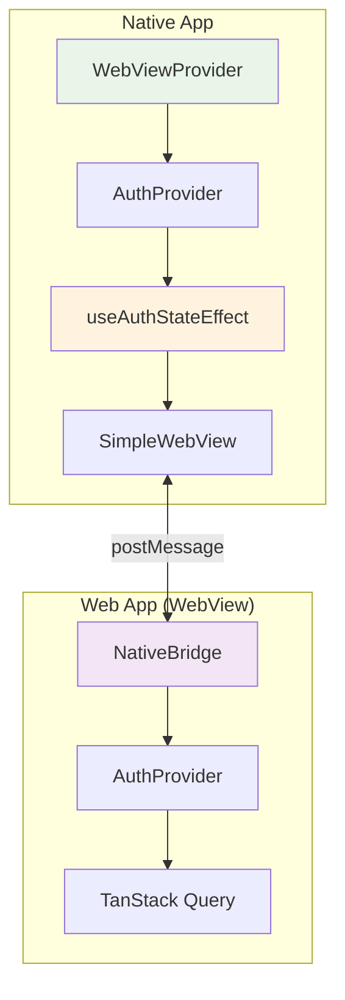
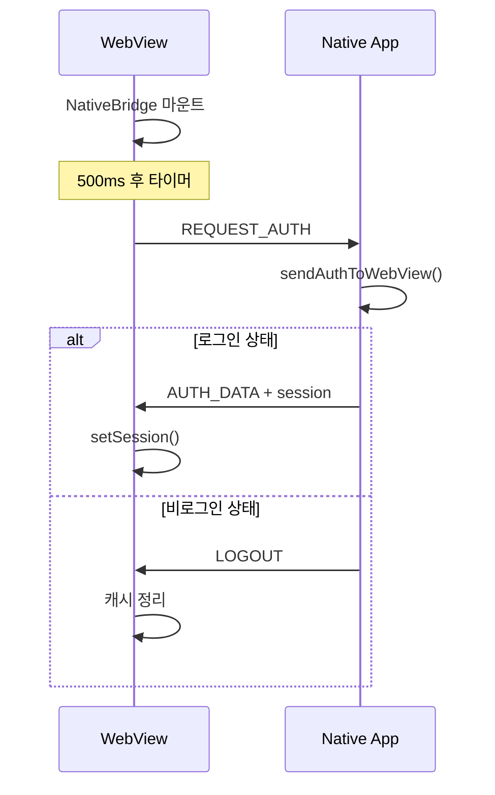
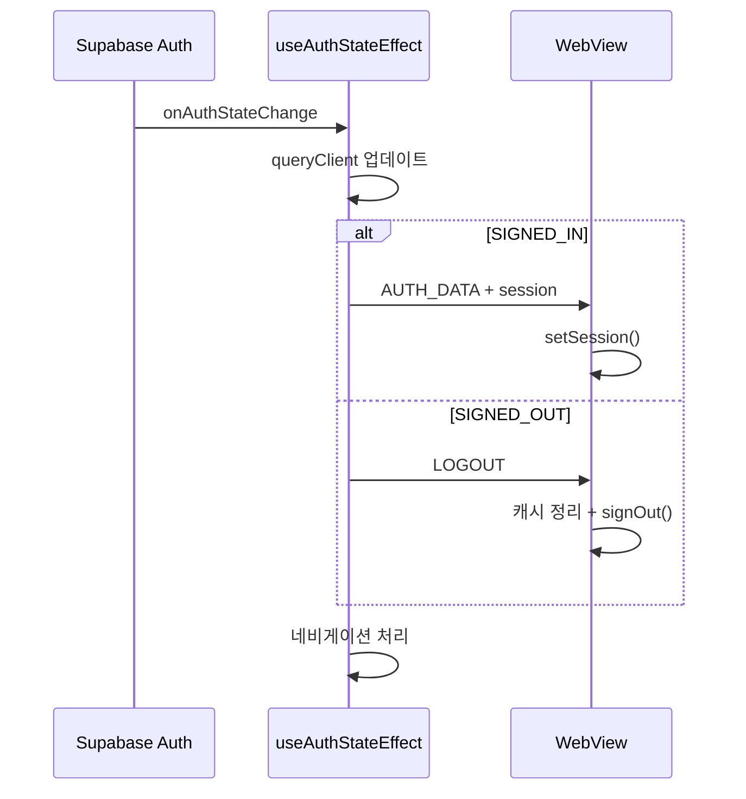

# WebView 연동 아키텍처

네이티브 앱과 웹 앱 간의 원활한 연동을 위한 WebView 아키텍처 설계 문서입니다.

## 전체 아키텍처



## 브릿지 통신 플로우

### 초기 로드 동기화



### 인증 상태 변경 시



## 핵심 구성 요소

### 1. 전역 WebView Context

**Provider 계층구조** (중요: 순서 지켜야 함):
```typescript
<WebViewProvider>     {/* 최상위 */}
  <AuthProvider>       {/* WebView ref 사용 */}
    <App />
  </AuthProvider>
</WebViewProvider>
```

### 2. 메시지 타입 정의

```typescript
type NativeMessage = 
  | { type: "AUTH_DATA"; user: User; session: Session | null }
  | { type: "LOGOUT" }
  | { type: "GO_BACK" }
  | { type: "REQUEST_AUTH" };
```

### 3. 브릿지 통신 핵심 로직

**네이티브 → 웹**: `postMessage(JSON.stringify(message))`
**웹 → 네이티브**: `window.ReactNativeWebView.postMessage(JSON.stringify(message))`

### 4. 타이밍 처리

- **초기 로드**: 웹뷰에서 500ms 후 `REQUEST_AUTH` 전송
- **상태 변경**: `useAuthStateEffect`에서 자동 브릿지 통신

> 📖 **인증 관련 세부사항**: [인증 아키텍처 문서](authentication-architecture.md)를 참조하세요.

## 에러 처리 패턴

### JSON 파싱 에러
```typescript
try {
  const message = JSON.parse(event.nativeEvent.data);
  // 메시지 처리
} catch (error) {
  console.error("Failed to parse WebView message:", error);
  // 앱 크래시 방지
}
```

### 네이티브 환경 체크
```typescript
if (!window.ReactNativeWebView) {
  return; // 네이티브 환경이 아니면 무시
}
```

## WebView URL 구성

```typescript
// 네이티브에서 WebView 로드
const webViewUrl = `${WEB_APP_URL}?native=true&hideHeader=true`;
```

**쿼리 파라미터**:
- `native=true`: 네이티브 앱 내 WebView임을 식별
- `hideHeader=true`: 웹 앱 헤더 숨김 (중복 헤더 방지)

## 개발 시 주의사항

- **Provider 순서**: WebViewProvider > AuthProvider (의존성 순서 중요)
- **네이티브 환경 체크**: `window.ReactNativeWebView` 존재 확인
- **메시지 파싱**: try-catch로 JSON 파싱 에러 방지
- **타이밍**: 500ms 후 초기 인증 요청으로 확실한 동기화

## 관련 문서

- [인증 아키텍처](authentication-architecture.md) - 인증 플로우와 에러 처리 상세 정보