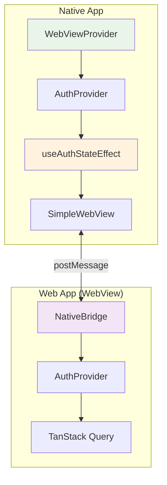
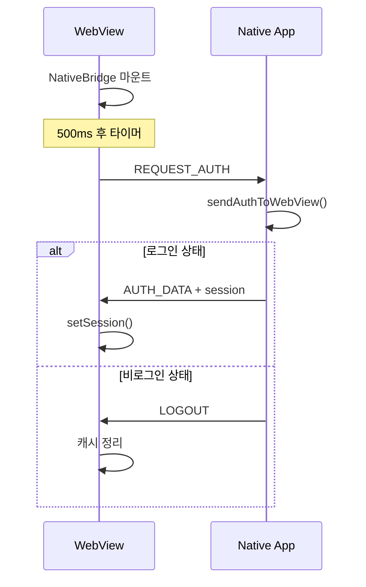
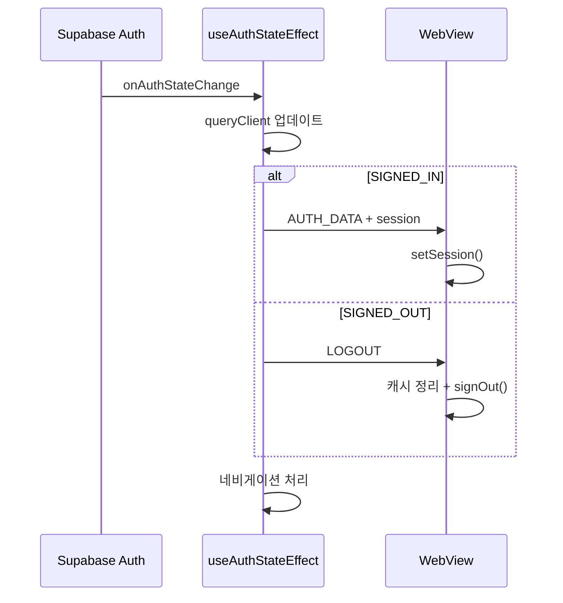

# WebView 연동 아키텍처

네이티브 앱과 웹 앱 간의 원활한 연동을 위한 WebView 아키텍처 설계 문서입니다.

## 전체 아키텍처



## 브릿지 통신 플로우

### 초기 로드 동기화



### 인증 상태 변경 시



## 핵심 구성 요소

### 1. 전역 WebView Context

```typescript
// Provider 계층구조 (중요: 순서 지켜야 함)
<WebViewProvider>     {/* 최상위 */}
  <AuthProvider>       {/* WebView ref 사용 */}
    <App />
  </AuthProvider>
</WebViewProvider>
```

### 2. 중앙화된 브릿지 통신

**`useAuthStateEffect`에서 인증 상태 변경 시 자동 처리**:

```typescript
// 1. TanStack Query 업데이트
queryClient.setQueryData(["user"], session?.user ?? null);

// 2. WebView 브릿지 통신 (네비게이션 전에 처리)
if (webViewRef.current) {
  if (event === "SIGNED_IN") {
    webViewRef.current.postMessage(JSON.stringify({
      type: "AUTH_DATA",
      user: { id: session.user.id, email: session.user.email },
      session: { access_token, refresh_token }
    }));
  } else if (event === "SIGNED_OUT") {
    webViewRef.current.postMessage(JSON.stringify({ type: "LOGOUT" }));
  }
}

// 3. 네비게이션 처리
```

### 3. 메시지 타입 정의

```typescript
type NativeMessage = 
  | { type: "AUTH_DATA"; user: User; session: Session | null }
  | { type: "LOGOUT" }
  | { type: "GO_BACK" }
  | { type: "REQUEST_AUTH" };
```

### 4. 웹 앱 메시지 처리 (핵심 로직만)

```typescript
// AUTH_DATA 처리
if (message.type === "AUTH_DATA" && message.session) {
  supabase.auth.setSession({
    access_token: message.session.access_token,
    refresh_token: message.session.refresh_token,
  });
}

// LOGOUT 처리  
else if (message.type === "LOGOUT") {
  queryClient.setQueryData(["user"], null);
  queryClient.clear();
  supabase.auth.signOut().catch(() => {
    console.log("Supabase signOut error ignored");
  });
}
```

## 에러 처리 패턴

### AuthSessionMissingError
```typescript
// 네이티브/웹 공통 패턴
queryClient.setQueryData(["user"], null);
queryClient.clear();

supabase.auth.signOut().catch(() => {
  console.log("Supabase signOut error ignored (session may already be cleared)");
});
```

### JSON 파싱 에러
```typescript
try {
  const message = JSON.parse(event.nativeEvent.data);
  // 메시지 처리
} catch (error) {
  console.error("Failed to parse WebView message:", error);
  // 앱 크래시 방지
}
```

## 주요 개선사항

1. **🎯 중앙화된 브릿지 통신**: `useAuthStateEffect`에서 인증 상태 변경 시 자동 동기화
2. **🌐 전역 WebView Context**: 컴포넌트 간 일관된 WebView ref 공유
3. **🔄 양방향 통신**: REQUEST_AUTH, AUTH_DATA, LOGOUT, GO_BACK 메시지 지원  
4. **⏰ 타이밍 이슈 해결**: 웹뷰 로드 후 초기 인증 상태 요청으로 확실한 동기화
5. **🛡️ 에러 처리 강화**: JSON 파싱, AuthSessionMissingError 등 안전한 처리

## 개발 시 주의사항

- **Provider 순서**: WebViewProvider > AuthProvider (의존성 순서 중요)
- **네이티브 환경 체크**: `window.ReactNativeWebView` 존재 확인
- **메시지 파싱**: try-catch로 JSON 파싱 에러 방지
- **세션 에러**: AuthSessionMissingError는 catch로 무시 처리