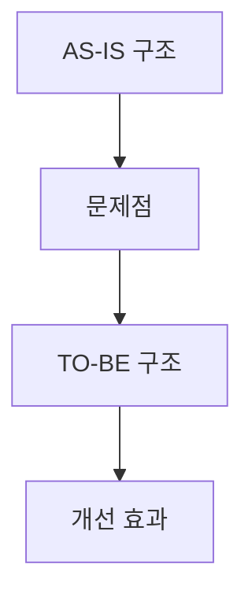

# History 문서 작성 가이드

이 템플릿은 복잡한 기술적 문제 해결이나 아키텍처 개선 작업의 맥락을 보존하기 위한 사후 보고서 스타일 문서입니다.

## 📋 문서 작성 규칙

### 작성 대상
- **복잡한 기술적 문제 해결**: 3단계 이상의 접근 방법을 시도한 경우
- **아키텍처 개선**: 시스템 구조 변경이나 패턴 도입
- **성능 최적화**: 병목 지점 분석 및 개선 작업
- **크로스 플랫폼 이슈**: iOS/Android 등 플랫폼별 차이점 해결
- **연장 세션**: 단일 세션에서 완료되지 않은 복잡한 작업

### 작성 원칙
- **한국어 기반**: 모든 내용은 한국어로 작성
- **핵심 중심**: 사후 보고서 관점에서 핵심 내용만 포함
- **코드 포함**: AS-IS/TO-BE 비교 코드 및 핵심 구현 코드 필수
- **맥락 보존**: 프롬프트 지시사항과 문제 해결 과정의 논리적 흐름 기록
- **시각적 도구 활용**: 복잡한 아키텍처나 데이터 플로우는 구조도, 플로우차트 등으로 표현

### 파일 명명 규칙
`YYYY-MM-DD-[작업명-축약].md`

**예시**: `2025-09-21-deeplink-improvement.md`

---

# [작업명] 사후 보고서

**일시**: YYYY-MM-DD
**소요 시간**: [작업 기간]
**작업 유형**: [기술적 문제 해결 / 아키텍처 개선 / 기능 개발 / 버그 수정]

## 🚨 문제 상황 (Situation)

### 발생한 문제
- 현재 상황과 문제점 설명
- 문제의 영향도 및 우선순위

### 주요 프롬프트 지시사항
> 사용자가 요청한 핵심 지시사항들
> - 요구사항 1
> - 요구사항 2
> - 중요한 제약조건이나 방향성

### AS-IS (기존 상태)
```typescript
// 기존 구현 방식
const currentImplementation = () => {
  // 문제가 있던 코드
};
```

## 🎯 행동 (Action)

### 접근 방법 및 해결 과정
1. **1차 시도**: [시도한 방법] → [결과/실패 이유]
2. **2차 시도**: [시도한 방법] → [결과/실패 이유]
3. **최종 해결책**: [채택한 방법] → [성공]

### 핵심 구현 코드
```typescript
// TO-BE: 최종 해결 코드
const newImplementation = () => {
  // 개선된 구현
};
```

### 시스템 구조도 (선택사항)
복잡한 아키텍처 변경이나 데이터 플로우가 있는 경우 다음과 같은 시각적 도구를 활용:



**시각화 도구 예시**:
- **구조도**: 컴포넌트 관계, 의존성 구조
- **플로우차트**: 데이터 흐름, 로직 분기
- **시퀀스 다이어그램**: API 호출 순서, 이벤트 플로우
- **상태 다이어그램**: 상태 전환, 생명주기

### 주요 변경 파일
- `파일경로1`: 변경 목적 및 내용
- `파일경로2`: 변경 목적 및 내용

## ✅ 결과 (Result)

### TO-BE (개선된 상태)
- 해결된 문제점들
- 새로 추가된 기능이나 개선사항

### 작업 커밋
```bash
hash1 feat: 주요 기능 구현
hash2 fix: 핵심 버그 수정
hash3 refactor: 아키텍처 개선
```

### AS-IS vs TO-BE 비교
| 항목 | AS-IS | TO-BE | 개선 효과 |
|------|-------|-------|-----------|
| 핵심 기능 | 기존 동작 | 개선된 동작 | 구체적 향상 |
| 성능 | 기존 지표 | 개선 지표 | 개선율 |

## 📈 영향 (Impact)

### 기술적 영향
- 아키텍처 개선 효과
- 코드 품질 향상
- 성능 개선 지표

### 비즈니스 영향
- 사용자 경험 개선
- 개발 효율성 향상
- 유지보수성 개선

## 🤔 회고 (Learning)

### 핵심 학습사항
- 새로 배운 기술/패턴
- 문제 해결 과정에서 얻은 인사이트
- 적용한 Best Practice

### 아쉬웠던 점
- 시행착오 과정
- 놓쳤던 부분들
- 더 효율적이었을 수 있는 방법

### 다음 작업시 고려사항
- 유사 문제 발생시 참고 포인트
- 예방 가능한 이슈들
- 개선할 수 있는 접근 방식